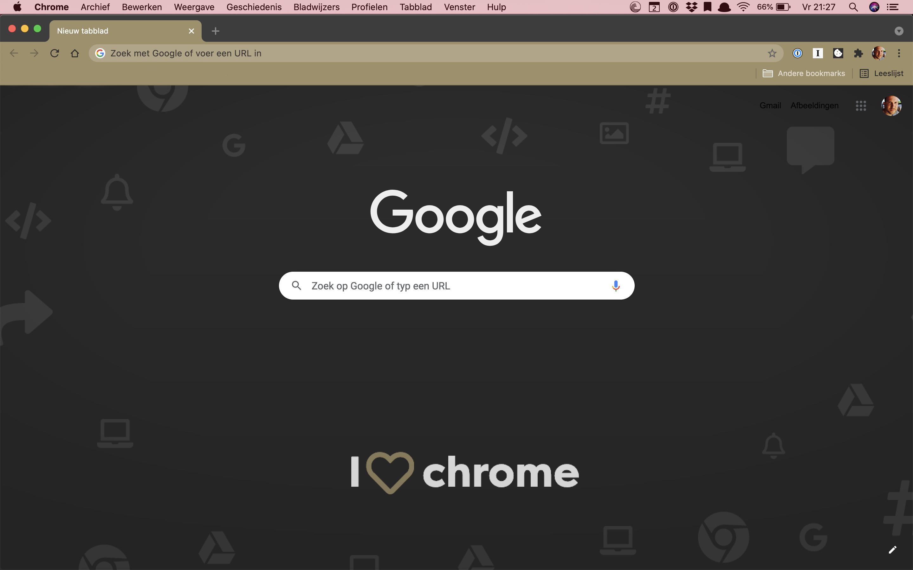

# Drops of Gold Google Chrome Theme

A handcrafted theme for the Google Chrome Browser. Please be aware, I no longer maintain this repo.
  
 
 

## Getting started

There are two ways:

1. Recommended:
   Just look for Drops of Gold Theme in the Google Web Store. [Download from Google Chrome Store][c]

2. Use the [unpacked version](./theme/drops-of-gold)
3. Navigate to `chrome://extensions`
4. Enable `Developer mode` <small>(top-right corner)</small>
5. Click on <kbd>Load unpacked</kbd> button <small>(top-left corner)</small>
6. Select the [`theme/drops-of-gold`](./theme/drops-of-gold) folder and done

  

## Changelog

[❯ Read the changelog here →](changelog.md)

  

## Reporting bugs

If you find an issue, [let me know here on Github](https://github.com/thijswillemmoens/drops-of-gold-google-chrome/issues/new).
  

## Contributions

Anyone is welcome to contribute to this Google Chrome Theme.

There are various ways you can contribute:

-   [Raise an issue](https://github.com/thijswillemmoens/drops-of-gold-google-chrome/issues) on GitHub.
-   Send us a Pull Request with your bug fixes and/or new features.

## Sponsor

Enjoy my Open Source and free work and [don't forget to tip the waiter.](https://github.com/thijswillemmoens/sponsor) ☕

    
&nbsp;<small> Follow me on Twitter</small>

    
&nbsp;<small>Check out my website with interessting articles</small>

    
&nbsp;<small>Connect on LinkedIn</small>

